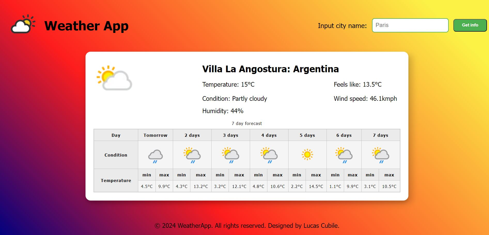

# Weather-app

An app to start handling data-fetching about weather information in specific locations.

# What the project is about

The project is a weather forecast app for the next seven days at a target location.

# What have I learned so far?

This project is the first implementation of fetching data from an API in order to display it on the client through the use of fetch API.

<ul>
  <li>Use of fetch.</li>
  <li>Separation of concerns through components.</li>
  <li>Environment variables to keep data like API keys safe.</li>
  <li>Bundle optimization in webpack.</li>
</ul>

# Want to see it in action?

<a href="https://hroglardev.github.io/Weather-app/" target="_blank">Click here</a>

# How to use the app.

The app loads your current location's weather by default. It displays the current weather as well as the next 7 days in a table format.

If you want to get a specific location's forecast use the input at the top of the page to type the city name and then use the button to retrieve the data. Notice a loader will display next to the input and the page will show a skeleton while the data is being fetched.

Once the data is fetched, the information is updated and displayed in the same format.

# Want to track my progress?

Checkout my other projects in order to see my evolution:

<ol>
  <li><a href="https://github.com/hroglardev/odin-recipes" target="_blank">Recipes</a></li>
  <li><a href="https://github.com/hroglardev/Odin-landing-page" target="_blank">Landing Page</a></li>
  <li><a href="https://github.com/hroglardev/Rock-Paper-Scissors-TOP-Console" target="_blank">Console Rock, Paper, Scissors</a></li>
  <li><a href="https://github.com/hroglardev/Rock-Paper-Scissors-TOP" target="_blank">Rock, Paper, Scissors</a></li>
  <li><a href="https://github.com/hroglardev/Etch-a-Sketch" target="_blank">Etch a Sketch</a></li>
  <li><a href="https://github.com/hroglardev/Calculator" target="_blank">Calculator</a></li>
  <li><a href="https://github.com/hroglardev/Sign-up-form-TOP" target="_blank">Sign up form</a></li>
  <li><a href="https://github.com/hroglardev/Dashboard" target="_blank">Dashboard</a></li>
  <li><a href="https://github.com/hroglardev/Library" target="_blank">Library</a></li>
  <li><a href="https://github.com/hroglardev/Tic-tac-toe" target="_blank">Tic-tac-toe</a></li>
  <li><a href="https://github.com/hroglardev/Restaurant-page" target="_blank">Restaurant page</a></li>
  <li><a href="https://github.com/hroglardev/To-do-list-js" target="_blank">To-do-list</a></li>
  <li><a href="https://github.com/hroglardev/Weather-app" target="_blank">You are here</a></li>
</ol>
